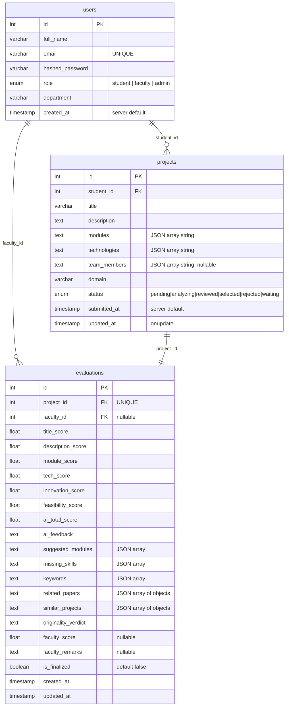

# Schemas

---

## Database Schema (PostgreSQL)



---

## API Request / Response Schemas

### Auth

#### POST `/api/v1/auth/register`
**Request — `UserRegister`**
```json
{
  "full_name": "Alice Johnson",
  "email": "alice@example.com",
  "password": "secret123",
  "role": "student",
  "department": "Computer Science"
}
```

**Response 201 — `UserOut`**
```json
{
  "id": 1,
  "full_name": "Alice Johnson",
  "email": "alice@example.com",
  "role": "student",
  "department": "Computer Science",
  "created_at": "2026-04-10T07:00:00"
}
```

---

#### POST `/api/v1/auth/login`
**Request — `UserLogin`**
```json
{
  "email": "alice@example.com",
  "password": "secret123"
}
```

**Response 200 — `TokenOut`**
```json
{
  "access_token": "eyJhbGciOiJIUzI1NiIsInR5cCI6IkpXVCJ9…",
  "token_type": "bearer",
  "user": {
    "id": 1,
    "full_name": "Alice Johnson",
    "email": "alice@example.com",
    "role": "student",
    "department": "Computer Science"
  }
}
```

---

### Projects

#### POST `/api/v1/projects/`
**Request — `ProjectSubmit`**
```json
{
  "title": "AI-Based Student Performance Predictor",
  "description": "This project develops a machine learning system that predicts student academic performance…",
  "modules": ["Data Collection", "ML Model Training", "Prediction API", "Faculty Dashboard"],
  "technologies": ["Python", "Scikit-learn", "FastAPI", "React", "PostgreSQL"],
  "team_members": ["Alice Johnson", "Bob Smith"],
  "domain": "ml_ai"
}
```

**Response 201 — `ProjectOut`**
```json
{
  "id": 1,
  "student_id": 1,
  "title": "AI-Based Student Performance Predictor",
  "description": "…",
  "modules": ["Data Collection", "ML Model Training", "Prediction API", "Faculty Dashboard"],
  "technologies": ["Python", "Scikit-learn", "FastAPI", "React", "PostgreSQL"],
  "team_members": ["Alice Johnson", "Bob Smith"],
  "domain": "ml_ai",
  "status": "analyzing",
  "submitted_at": "2026-04-10T08:00:00"
}
```

---

#### PATCH `/api/v1/projects/{id}/status`
**Request — `ProjectStatusUpdate`**
```json
{
  "status": "selected"
}
```
Valid values: `pending` · `analyzing` · `reviewed` · `selected` · `rejected` · `waiting`

---

### Evaluations

#### GET `/api/v1/evaluations/{project_id}`
**Response 200 — `EvaluationOut`**
```json
{
  "id": 1,
  "project_id": 1,
  "title_score": 72.0,
  "description_score": 85.0,
  "module_score": 90.0,
  "tech_score": 88.0,
  "innovation_score": 76.0,
  "feasibility_score": 82.0,
  "ai_total_score": 83.5,
  "ai_feedback": "### Overall Assessment\n\nThis project demonstrates strong technical depth…",
  "suggested_modules": ["Model Monitoring", "A/B Testing Module", "API Rate Limiter"],
  "missing_skills": ["Docker", "Kubernetes", "MLflow"],
  "keywords": ["machine learning", "prediction", "student performance", "random forest"],
  "related_papers": [
    {
      "title": "Predicting Student Performance Using Data Mining",
      "url": "https://example.com/paper1",
      "snippet": "This study applies decision trees and neural networks…"
    }
  ],
  "similar_projects": [
    {
      "title": "Student Grade Prediction System - GitHub",
      "url": "https://github.com/example/grade-predictor",
      "snippet": "A Flask-based web app that uses Random Forest…"
    }
  ],
  "originality_verdict": "The project shows moderate originality. While student performance prediction is a well-explored area, the specific combination of real-time intervention alerts and faculty dashboard adds meaningful novelty.",
  "faculty_score": null,
  "faculty_remarks": null,
  "is_finalized": false
}
```

---

#### PATCH `/api/v1/evaluations/{project_id}/faculty-review`
**Request — `FacultyReview`**
```json
{
  "faculty_score": 88.0,
  "faculty_remarks": "Excellent technical stack. The real-time intervention feature is particularly impressive. Recommend selecting this project.",
  "is_finalized": true,
  "project_status": "selected"
}
```

---

## AI Scoring Rubric

| Criterion | Weight | Scoring Logic |
|---|---|---|
| **Title** | 10% | Word count (2–8 ideal), domain keyword presence |
| **Description** | 20% | Length (≥150 words ideal), sentence variety |
| **Modules** | 20% | Count adequacy (≥4 ideal), distinct names |
| **Technologies** | 20% | Stack coverage for domain, breadth |
| **Innovation** | 15% | Semantic cosine similarity to innovation vocabulary |
| **Feasibility** | 15% | Module-to-technology ratio balance |
| **Total** | 100% | Weighted average of above |

---

## JWT Token Payload

```json
{
  "sub": "1",
  "role": "student",
  "exp": 1744368000
}
```

- `sub` — user ID as string (decoded to `int` in `deps.py`)
- `role` — user role for authorization checks
- `exp` — expiry timestamp (default: 480 minutes from issue)

---

## Project Status Enum

| Status | Meaning |
|---|---|
| `pending` | Submitted, not yet picked up |
| `analyzing` | AI pipeline running |
| `reviewed` | AI analysis complete, awaiting faculty |
| `selected` | Faculty selected the project |
| `rejected` | Faculty rejected the project |
| `waiting` | Faculty placed on waitlist |

---

## Role Permissions

| Endpoint | student | faculty | admin |
|---|---|---|---|
| POST `/projects/` | ✅ | ❌ | ✅ |
| GET `/projects/my` | ✅ | ❌ | ✅ |
| GET `/projects/` | ❌ | ✅ | ✅ |
| GET `/projects/{id}` | ✅ own | ✅ | ✅ |
| PATCH `/projects/{id}/status` | ❌ | ✅ | ✅ |
| GET `/evaluations/{id}` | ✅ own | ✅ | ✅ |
| PATCH `/evaluations/{id}/faculty-review` | ❌ | ✅ | ✅ |
