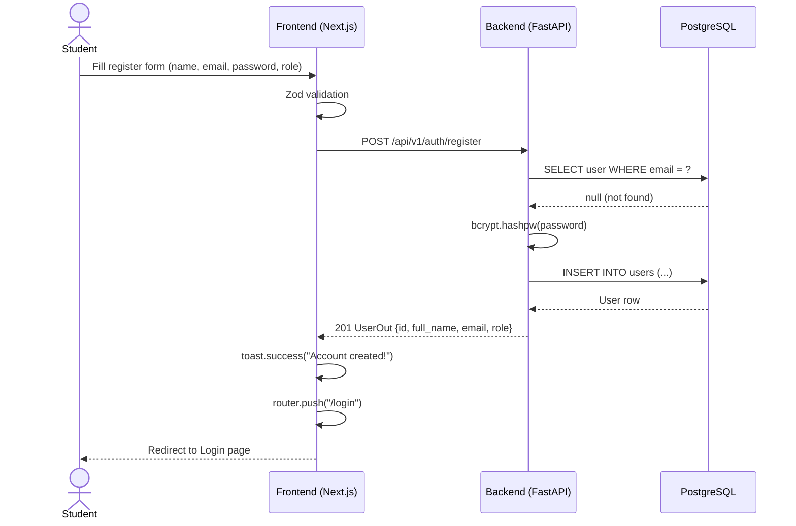
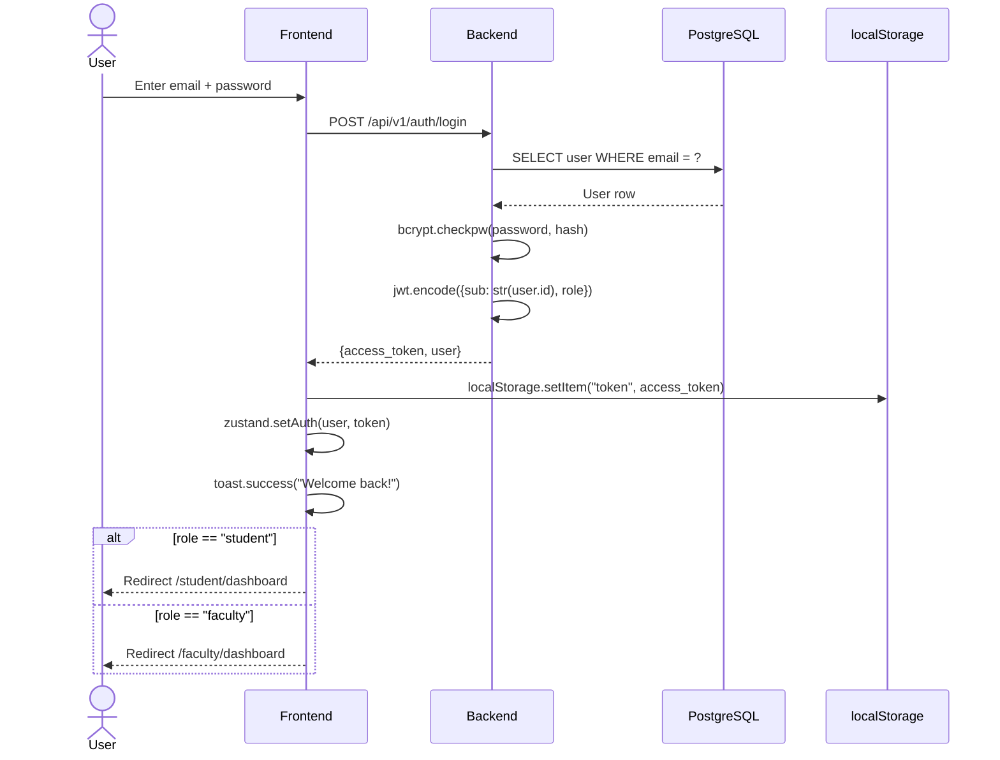
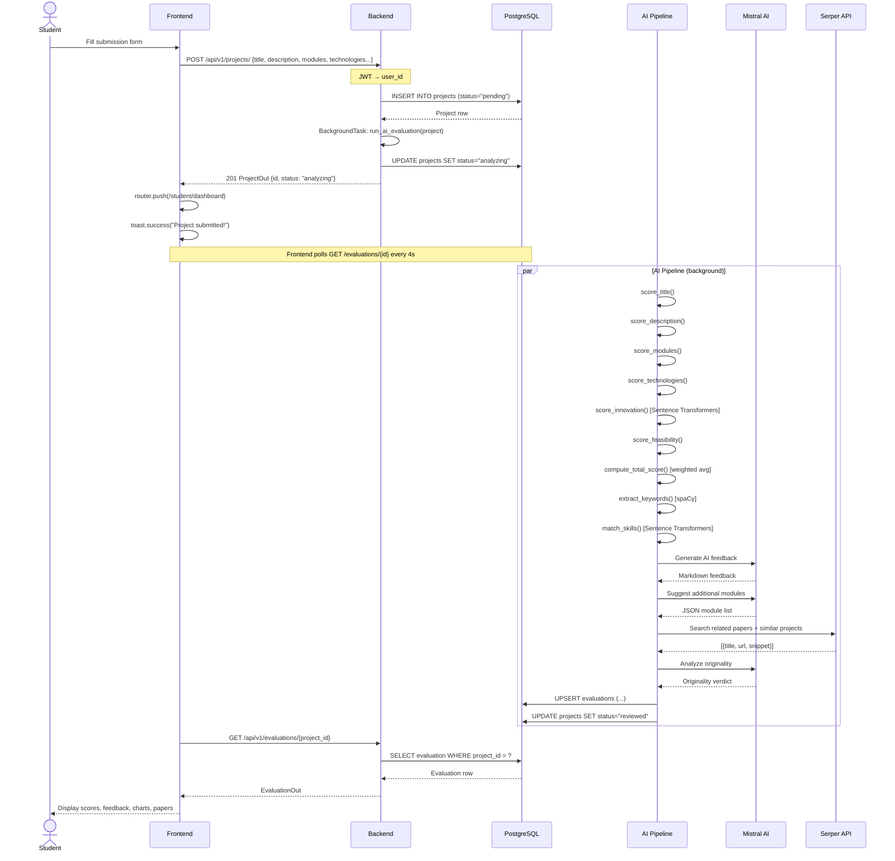
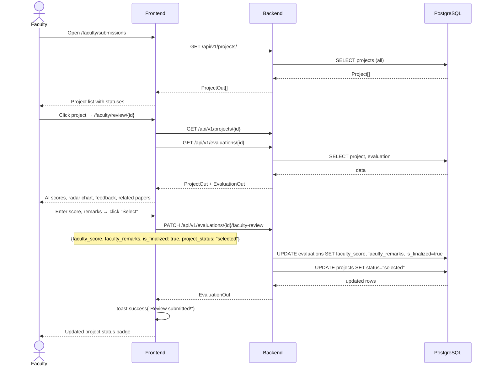
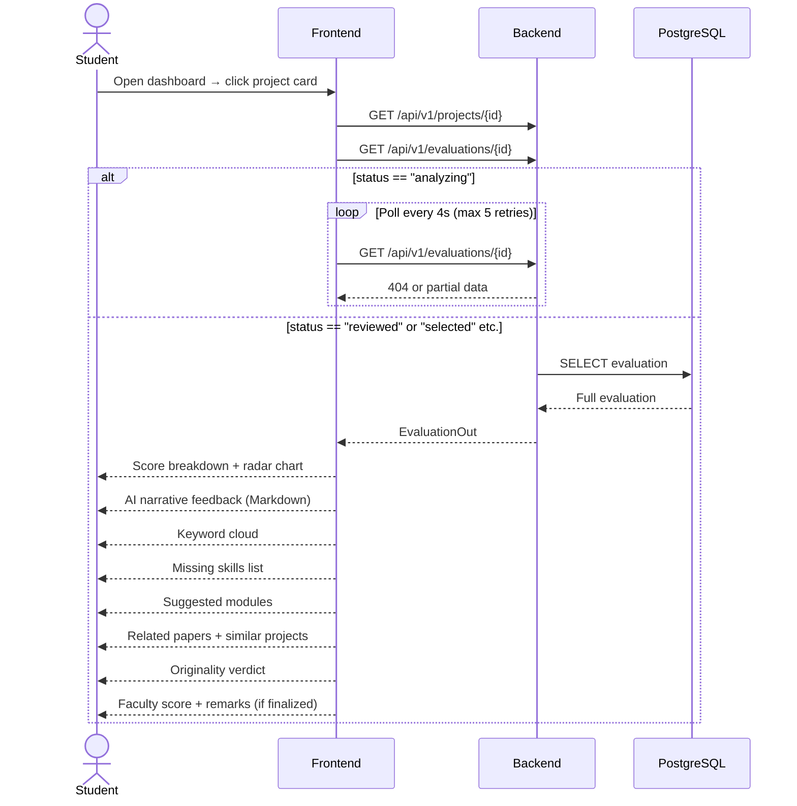
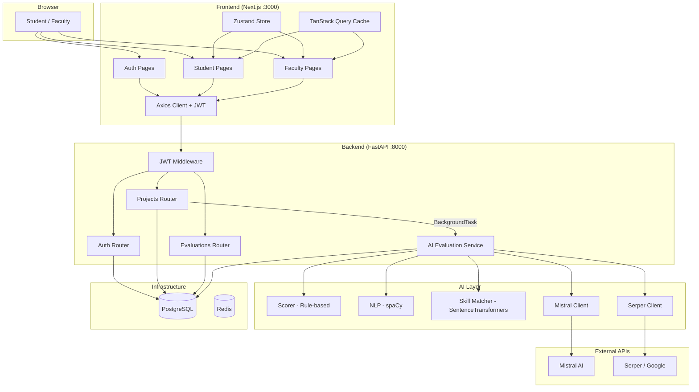
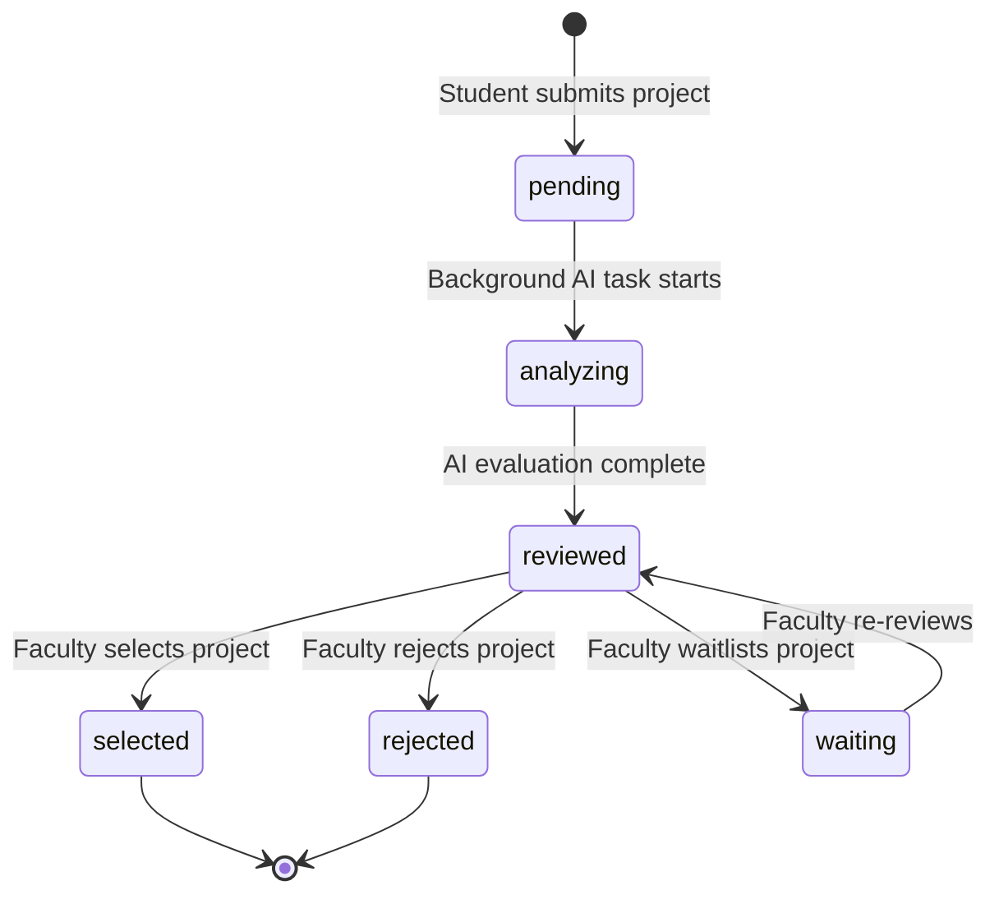

# Sequence & Flow Diagrams

All diagrams use [Mermaid](https://mermaid.js.org/) syntax — render them on GitHub, VS Code (Mermaid Preview extension), or [mermaid.live](https://mermaid.live).

---

## 1. User Registration

---

## 2. User Login

---

## 3. Project Submission & AI Evaluation

---

## 4. Faculty Review

---

## 5. Student Viewing Feedback

---

## 6. Full System Data Flow

---

## 7. Project Status State Machine

